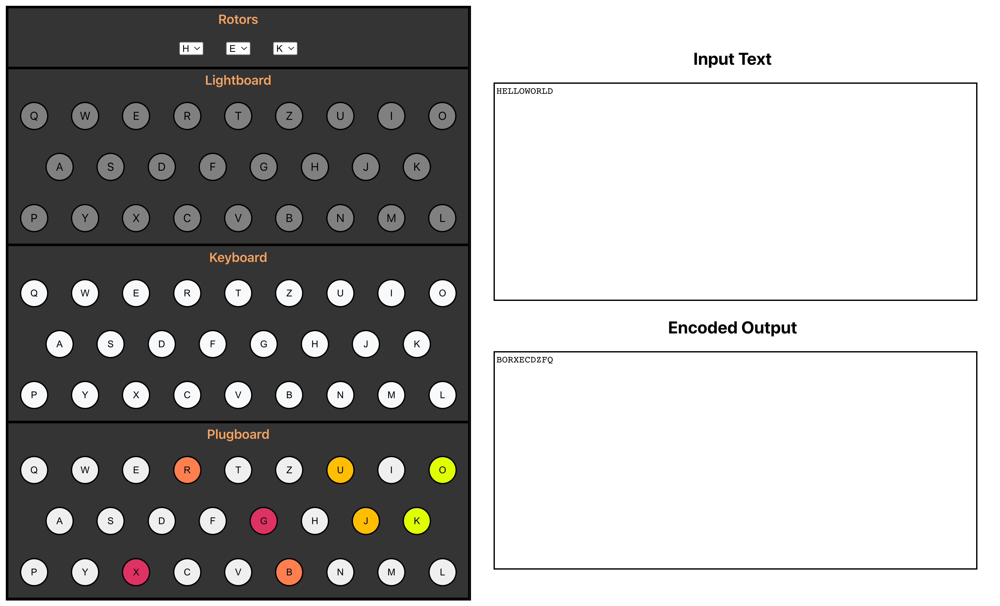

# Engima Machine

This repo is an interactive recreation of an [enigma machine](https://en.wikipedia.org/wiki/Enigma_machine), the WWII era machine used by Nazi Germany to encode and decode messages.




## How to use this simulator

To run the engima machine, follow this procedure.

1. Download this repository to your local machine.
2. From the root directory, build and run the repo.
   ```
   $> yarn start
   ```
3. Navigate in your browser to http://localhost:3000/


## How enigma works
At a high level, an enigma machine would route a letter from the keyboard input through the machine and would illuminate the lightboard with the encoded letter.  The secret to the enigma's effectiveness was that the encoding changed after every letter.

### Letter signal routing

The path of a letter as it is routed through the machine is:

1. Keyboard input
2. Plugboard
3. Fast rotor
4. Medium rotor
5. Slow rotor
6. Reflector
7. Slow rotor
8. Medium rotor
9. Fast rotor
10. Plugboard
11. Lightboard

For a detailed breakdown of how an engima machine worked, watch this video.
[](https://www.youtube.com/watch?v=ybkkiGtJmkM)


## To Do

- General
  - Add button to reset machine configuration
  - Save / load configuration using local state
- Rotors
  - Allow user to change rotors
- Plugboard
  - Allow users to remove letter mappings
